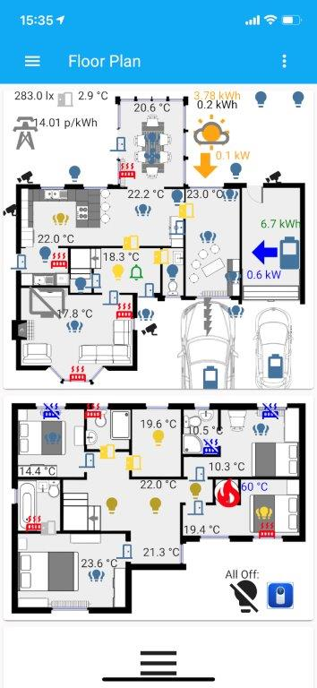
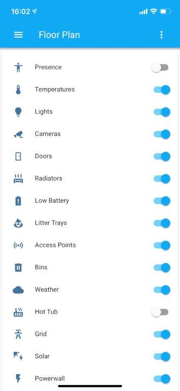
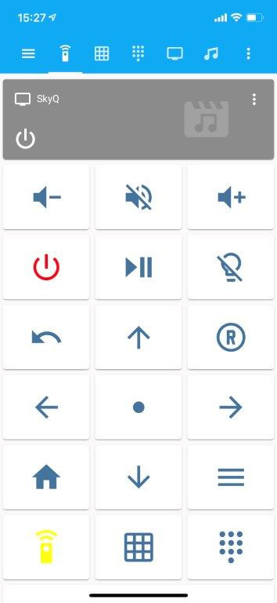
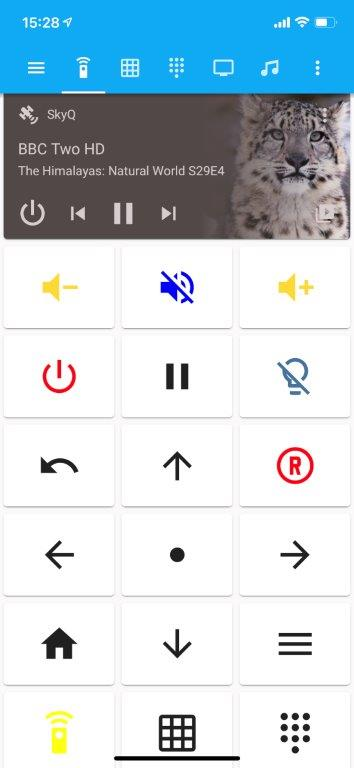
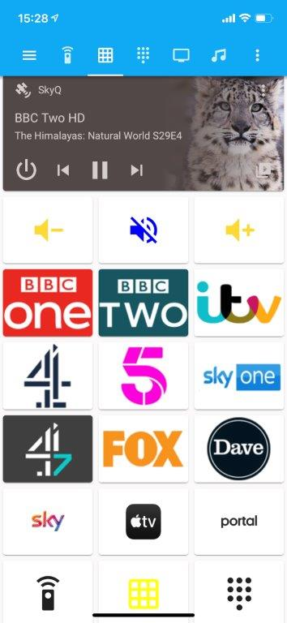
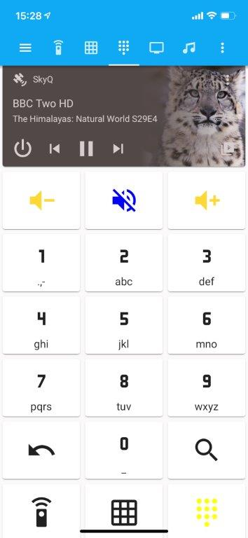
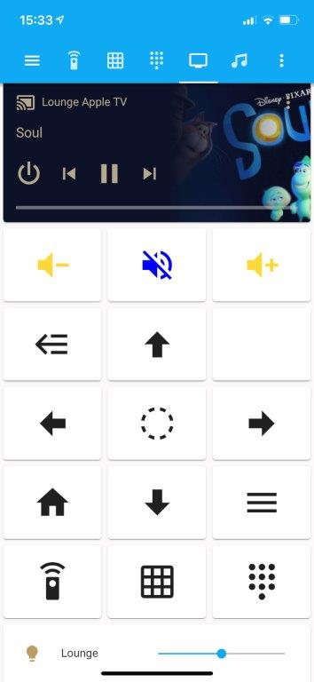
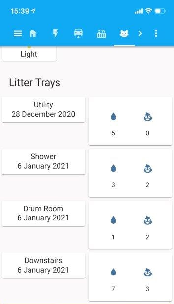
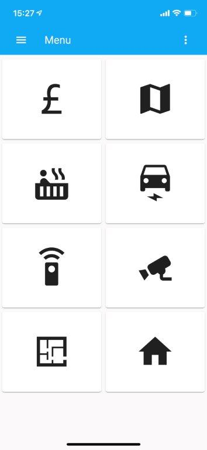

# Home Assistant Configuration

This is the Home Assistant configuration I've put together over the last year or so.
The config file is split into a large number of [packages](packages) to allow it to be browsed and reused more easily.
I'm doing my best to document each section so you can see what it is doing.

Most config files are in the [packages](packages) directory.  So browse around in there !

If you want to, you can.....

Main features are:

* [Floorplan](lovelace/floorplan/) with lights / radiators / temperatures / presence - entity types can be switched on and off. 
* [Remote Control](/lovelace/lounge-remote/) for Lounge AV equipment (SkyQ, Denon AV, Philips TV including Ambilight + Hue) 
* Room Level Presence using [room-assistant](packages/systems/room-assistant/) on several Raspberry Pi Zeros.
* [Hot Tub](packages/areas/garden) scheduling and monitoring and Octopus Agile/Go pricing optimisation for Balboa (and La-Z-Spa)
* [Cat Litter Tray monitoring](packages/systems/litter_trays) (using Flic buttons to track usage/cleaning and alert when cleaning required) 
* [Texecom Elite Intruder Alarm](packages/systems/texecom_alarm/) System via MQTT (gives access to movement sensors and door sensors as well as alarm status (incl. arming/disarming)
* Cost optimised charging of [Powerwall](packages/systems/tesla_powerwall) and [EVs](packages/systems/myenergi) for Octopus Agile/Go TOU Electric Tarrif with [Solar Forecasting](https://forecast.solar/).
* [Telegram Bot](packages/systems/telegram/) integration to allow status reporting and control of some house features from telegram messenge with free text or commands.
* [Unifi Protect](packages/systems/unifi-protect/) Cameras inside and outside the house with person and vehicle detection outside.
* [Deepstack](https://deepstack.cc/) AI Server on [Jetson Nano](https://developer.nvidia.com/embedded/jetson-nano-developer-kit) - Face and Object recongnition
* Control from Alexa or Siri, using Alexa integration & HomeKit
* Big and Easy to Use Phone Menu 
## [Hardware List](documents/hardwareList.md)
## [Add-ons, integrations and custom components](documents/HA_integrations_and_addons.md)
## [Helpers Created through UI](documents/helpers.md)

